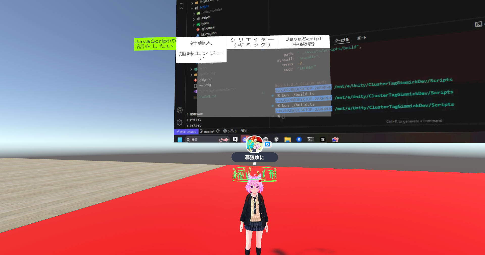

# ClusterTagGimmick

このプロジェクトは、Cluster内で自分の属性を頭の上に表示するギミックの開発を行っています。

masterブランチのmainシーンを以下のワールドにアップロードしています。
https://cluster.mu/w/5f6dfe4d-1268-4fba-8ad8-119b60491cc8

## 導入方法

- このリポジトリをcloneし、UnityHub経由で開いてください
  - 使うUnityバージョンは、clusterのドキュメントを参照してください
    - https://docs.cluster.mu/creatorkit/installation/install-unity/
- Creator Kitのドキュメントを参照して環境構築を行ってください

## 開発方法
- ギミックのスクリプトは、Scripts/以下にあります
- 詳しい開発方法は、Scripts/README.mdを参照してください
- コントリビュートする際は、developブランチに向けてPull Requestを作成してください

## ギミックの仕様について
- Document/以下にギミック全体の動作の仕組みの説明を記載しています